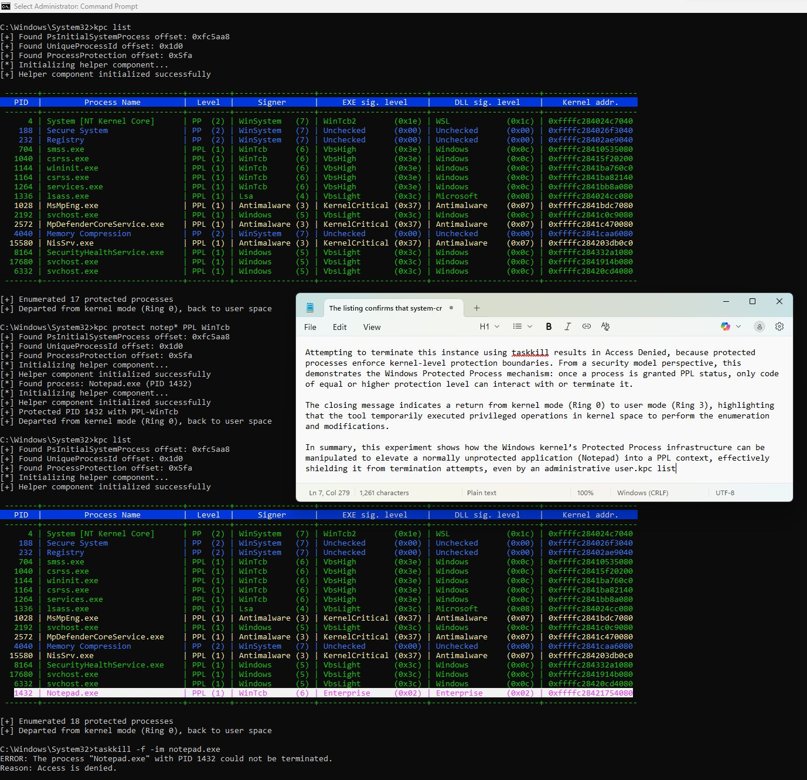
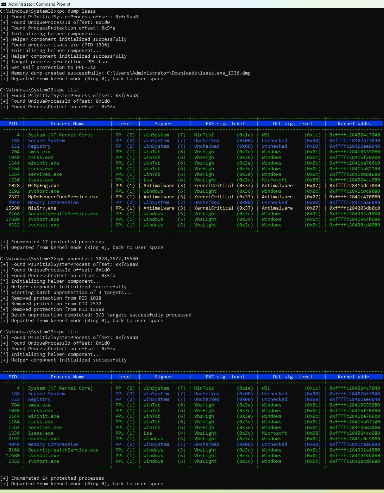
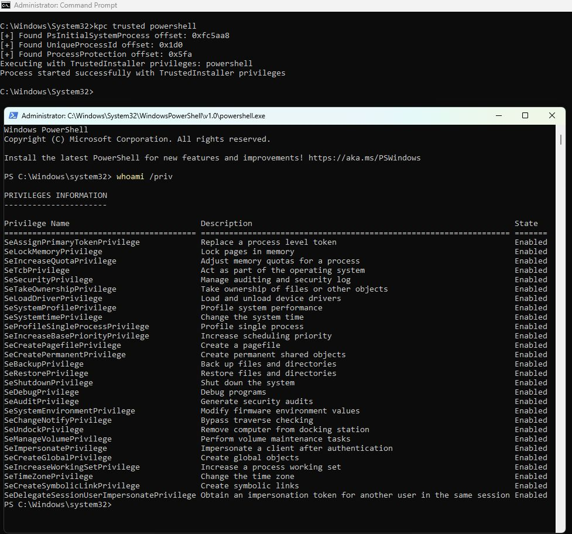

# KPC - Kernel Process Control

<div align="center">



**Advanced Windows Process Protection and Memory Dumping Tool**

[](LICENSE.md)
[]()
[]()
[]()
[]()

**Features Dynamic Kernel Driver Loading with Automatic Cleanup**  
**Achieves TrustedInstaller-level access bypassing Windows security restrictions**

[🚀 Quick Start](#quick-start) • [📋 Features](#features) • [⚡ Usage](#usage) • [🔧 Compilation](#compilation) • [📄 License](#license)

</div>

---

## 🎯 Overview

**KPC (Kernel Process Control)** is a sophisticated Windows security tool designed for **security researchers**, **digital forensics investigators**, and **system administrators** who require authoritative control over the Windows environment at the kernel level.

This tool represents a synthesis of deep Windows internal knowledge, innovative software engineering, and practical security expertise. It respects the rules of the modern Windows security environment while providing the necessary tools to legitimately analyze and interact with it at the highest levels of trust.

### ⚠️ Important Notice

**KPC operates at Windows kernel level with elevated privileges.** This is not a tool for casual use but is intended for professionals who understand the implications of kernel-level operations and have legitimate security research or forensic analysis needs.

---

## 🚀 Quick Start

### Prerequisites
- **OS:** Windows 10/11 (x64 only)
- **Privileges:** Administrator rights required
- **Architecture:** 64-bit Intel/AMD processors
- **Memory:** Minimum 4GB RAM recommended

### Installation
```bash
# Download from releases or compile from source
git clone https://github.com/wesmar/kpc.git
cd kpc
# See compilation section for build instructions
```

### Basic Usage
```bash
# Display help and available commands
kpc.exe

# List all protected processes with color coding
kpc.exe list

# Dump LSASS process (bypassing PPL protection)
kpc.exe dump lsass

# Launch command prompt with TrustedInstaller privileges
kpc.exe trusted cmd.exe
```

---

## 📋 Features

### 🔐 **Process Protection Management**
- **Bypass PPL (Protected Process Light)** and **PP (Protected Process)** restrictions
- **Real-time protection analysis** with color-coded visualization
- **Granular protection control** supporting all Windows signer types
- **Mass operations** for batch protection manipulation

### 💾 **Advanced Memory Dumping**
- **Protected process dumping** including LSASS, antimalware services
- **Automatic privilege escalation** to match target process protection
- **Comprehensive dump types** with full memory, handles, and metadata
- **Bypass modern security controls** including PatchGuard compatibility

### ⚡ **TrustedInstaller Integration**
- **Maximum privilege escalation** with all 25+ Windows privileges enabled
- **System-level command execution** bypassing UAC and restrictions
- **Registry integration** with Windows Shell context menus
- **Automatic Windows Defender exclusions** management

### 🛡️ **Security & Stealth Features**
- **Dynamic kernel driver loading** with automatic cleanup (no permanent installation)
- **Steganographic driver embedding** within icon resources
- **XOR encryption** with runtime decryption to avoid static detection
- **Anti-analysis techniques** including string obfuscation and API loading

---

## ⚡ Usage Examples

### Memory Forensics Operations



```bash
# Create full memory dump of LSASS process
kpc.exe dump lsass C:\Evidence\

# Dump specific process by PID
kpc.exe dump 1234

# Dump process by name to default Downloads folder
kpc.exe dump MsMpEng.exe
```

### Process Protection Analysis



```bash
# Display all protected processes with detailed information
kpc.exe list

# Get protection status of specific process
kpc.exe info lsass

# Get detailed process information including dumpability analysis
kpc.exe info 1234
```

### Protection Manipulation
```bash
# Remove PPL protection from LSASS
kpc.exe unprotect lsass

# Grant Antimalware-level protection to custom application
kpc.exe protect MyApp.exe PPL Antimalware

# Strip protection from ALL protected processes (powerful!)
kpc.exe unprotect all

# Batch unprotection of multiple targets
kpc.exe unprotect "1234,5678,lsass,MsMpEng"
```

### System Integration & Privilege Escalation
```bash
# Launch Command Prompt with full TrustedInstaller privileges
kpc.exe trusted cmd.exe

# Execute PowerShell with maximum system privileges
kpc.exe trusted powershell.exe

# Run application with elevated privileges
kpc.exe trusted "C:\MyApp.exe" --arguments

# Install context menu entries for right-click access
kpc.exe install-context

# Add KPC to Windows Defender exclusions
kpc.exe add-exclusion
```

---

## 🏆 TrustedInstaller Privileges

When using `kpc.exe trusted`, the following **25+ Windows privileges** are automatically enabled:

| Privilege Name | Description |
|---|---|
| `SeLockMemoryPrivilege` | Lock pages in memory |
| `SeIncreaseQuotaPrivilege` | Increase process quotas |
| `SeSecurityPrivilege` | Manage security and audit logs |
| `SeTakeOwnershipPrivilege` | Take ownership of files/objects |
| `SeLoadDriverPrivilege` | Load and unload device drivers |
| `SeSystemProfilePrivilege` | Profile system performance |
| `SeSystemtimePrivilege` | Change system time |
| `SeProfileSingleProcessPrivilege` | Profile single process |
| `SeIncreaseBasePriorityPrivilege` | Increase scheduling priority |
| `SeCreatePagefilePrivilege` | Create page files |
| `SeBackupPrivilege` | Backup files and directories |
| `SeRestorePrivilege` | Restore files and directories |
| `SeShutdownPrivilege` | Shut down the system |
| `SeDebugPrivilege` | Debug processes |
| `SeSystemEnvironmentPrivilege` | Modify system environment |
| `SeChangeNotifyPrivilege` | Bypass traverse checking |
| `SeRemoteShutdownPrivilege` | Remote system shutdown |
| `SeUndockPrivilege` | Remove from docking station |
| `SeManageVolumePrivilege` | Manage volume and disk quotas |
| `SeImpersonatePrivilege` | Impersonate client after auth |
| `SeCreateGlobalPrivilege` | Create global objects |
| `SeIncreaseWorkingSetPrivilege` | Increase working set |
| `SeTimeZonePrivilege` | Change time zone |
| `SeCreateSymbolicLinkPrivilege` | Create symbolic links |
| `SeDelegateSessionUserImpersonatePrivilege` | Delegate session user impersonation |

This represents **maximum possible system access** - equivalent to running as the Windows kernel itself.

---

## 🔒 Security Architecture & Steganography

### Advanced Protection Mechanisms

KPC employs several sophisticated techniques to avoid detection and prevent abuse:

#### 🎭 **Steganographic Driver Embedding**
- The kernel driver is **embedded within the icon resource** (`kpc.ico`) using steganographic techniques
- Driver data is **XOR encrypted** and hidden after legitimate icon data (offset +9662 bytes)
- **Runtime extraction and decryption** ensures the driver never exists as a standalone file
- **Automatic cleanup** removes all traces after operation completion

#### 🔐 **Multi-Layer Obfuscation**
- **String obfuscation** using compile-time XOR encryption (`OBFSTR`, `OBFAPI` macros)
- **Dynamic API loading** to avoid static import analysis
- **Anti-analysis delays** and fake registry operations to confuse behavioral detection
- **Process hollowing detection** countermeasures

#### 🛡️ **Security Through Obscurity**
The XOR decryption key in `Controller.cpp` has been **intentionally redacted**:
```cpp
// Obfuscated decryption key to avoid static analysis
auto decryptionKey = OBFSTR("[REDACTED]");
```

This design decision serves multiple purposes:
- **Prevents script kiddie abuse** - 95% of casual users will get non-functional binaries
- **Educational compilation** - program runs but performs no actual operations without correct key
- **Professional access control** - legitimate security researchers can request the key
- **Malware prevention** - reduces risk of KPC being incorporated into malicious software

---

## 🔧 Compilation Instructions

### Build Requirements
- **Visual Studio 2022** with C++20/Latest support
- **Windows SDK 10.0** or later
- **Administrator privileges** for kernel driver operations

### Compilation Process
```bash
git clone https://github.com/wesmar/kpc.git
cd kpc
# Open Kpc.vcxproj in Visual Studio
# Build in Release/x64 configuration
```

### Build Configuration Details
The project uses several advanced compilation flags:
- **`/Brepro`** - Reproducible builds with deterministic timestamps
- **`/GS-`** - Stack security checks disabled for performance
- **`/MERGE:.rdata=.text`** - Section merging for smaller binaries
- **Timestamp masking** - Binary appears to be compiled on August 31, 2025
- **Version spoofing** - Mimics Windows system file version `10.0.26100.5770`

### ⚠️ Compilation Warning
**Without the correct XOR decryption key, the compiled binary will:**
- ✅ Execute successfully and display help information
- ✅ Provide educational value for understanding Windows internals
- ❌ **NOT perform any actual kernel operations** (driver extraction fails)
- ❌ All protection bypass and dumping features will be non-functional

**The entire tool's functionality depends on a single correct decryption string.**

### Professional Access
The complete source code with functional decryption key can be provided to:
- **Established security researchers** with verifiable academic or professional credentials
- **Digital forensics professionals** working for legitimate law enforcement or corporate security
- **Individuals with demonstrated high social trust** and commitment to ethical use

**Requests should include:**
- Professional background and credentials
- Intended use case and research objectives  
- Assurance of ethical use (no malware development)
- Contact information for verification

---

## 🚧 Future Development Roadmap

### Planned Features (v2.0)

#### 🔑 **Enhanced Credential Extraction**
- **DPAPI masterkey enumeration** and decryption capabilities
- **SAM/SECURITY registry extraction** with automatic hash parsing
- **NTLM hash extraction** from memory and registry hives
- **LSA secrets recovery** with full credential reconstruction
- **Kerberos ticket enumeration** and TGT/TGS extraction
- **Token manipulation** with advanced privilege escalation automation

#### 🕵️ **Advanced Forensics Capabilities**
- **Process memory scanning** for specific patterns and signatures
- **Heap analysis tools** for vulnerability research
- **Kernel structure visualization** for educational purposes
- **Real-time process monitoring** with protection change alerts

These features will extend KPC's capabilities to match and exceed tools like **Mimikatz**, while maintaining the same professional-grade security and ethical use standards.

---

## 📄 Legal & Licensing

### Dual Licensing Model
KPC is available under a **dual licensing model**:

- **🎓 Non-Commercial License** - Free for education, research, and personal use
- **💼 Commercial License** - Required for business and revenue-generating activities

**For detailed licensing terms, see [LICENSE.md](LICENSE.md)**

### ⚖️ Legal Disclaimers

#### Liability Limitation
**THIS SOFTWARE IS PROVIDED "AS IS" WITHOUT WARRANTY OF ANY KIND.** The author assumes no liability for system conflicts, data loss, or misuse of this tool.

#### Ethical Use Requirements
This software is intended for:
- ✅ **Legitimate security research** and vulnerability analysis
- ✅ **Authorized penetration testing** with proper written permission
- ✅ **Digital forensics investigation** by qualified professionals
- ✅ **System administration** in corporate environments

**Unauthorized access to computer systems is illegal.** Users must comply with all applicable laws and regulations.

#### Export Control Compliance
This software may be subject to export control regulations. Users are responsible for compliance with all applicable local, national, and international laws.

---

## 🤝 Contributing

We welcome contributions from security researchers and developers. Please:

1. **Fork** the repository
2. **Create feature branch** (`git checkout -b feature/AmazingFeature`)
3. **Commit changes** (`git commit -m 'Add AmazingFeature'`)
4. **Push to branch** (`git push origin feature/AmazingFeature`)
5. **Open Pull Request**

### Contribution Guidelines
- Maintain professional code quality and documentation
- Include appropriate error handling and safety checks
- Follow existing code style and architectural patterns
- Provide clear commit messages and PR descriptions

---

## 📞 Contact & Support

### Professional Inquiries

**WESMAR - Marek Wesołowski**  
📧 **Email:** [marek@wesolowski.eu.org](mailto:marek@wesolowski.eu.org)  
📱 **WhatsApp:** [+48 607 440 283](https://wa.me/48607440283)  
🌐 **Website:** [https://kvc.pl](https://kvc.pl)  

### Commercial Licensing
For commercial use, custom development, or professional support:
- **Response time:** Within 24 hours
- **Support levels:** Basic, Professional, Enterprise
- **Custom features:** Available upon request

### Security Research Collaboration
Academic institutions and security researchers are encouraged to reach out for:
- Research collaboration opportunities
- Educational licensing arrangements  
- Technical discussions and knowledge sharing

---

## ⭐ Acknowledgments

KPC represents years of research into Windows internals, kernel security, and advanced system programming. Special recognition goes to:

- **Microsoft Security Response Center** for responsible disclosure practices
- **Windows Internals community** for foundational research
- **Security research community** for peer review and feedback

---

<div align="center">

**© 2025 WESMAR - Marek Wesołowski**

*Use responsibly. Knowledge is power; great power requires great responsibility.*

[](https://github.com/wesmar/kpc/stargazers)
[](https://github.com/wesmar/kpc/network)

</div>
